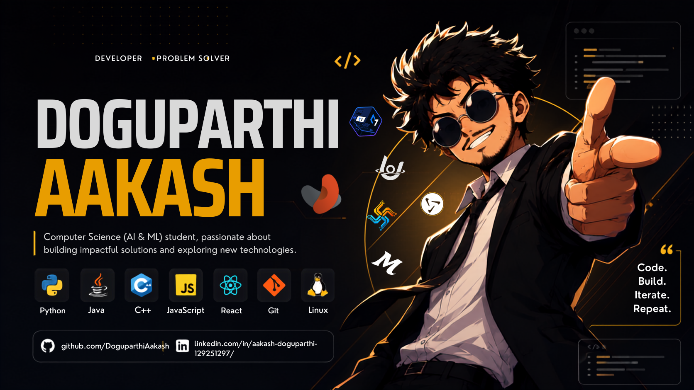

<div align="center">



# **Aakash Doguparthi**

## My main tech stack

<a href="https://skillicons.dev">
  
</a>

---

## Profile

### Engineering student in **Artificial Intelligence & Machine Learning**
### Focus areas:

* Deep Learning and Computer Vision
* Edge AI and Embedded Systems
* Operating Systems and System Design
### Approach:

* Performance-oriented engineering
* System-level thinking
* Practical implementation

---

## Technical Domain

<div align="left">

```
AI Systems ──────────────┐
                         ├──► Intelligent Architecture
Systems Programming ─────┤
                         ├──► Efficient Execution
Embedded & Edge AI ──────┘
```

</div>

---

## Technology Stack

### Artificial Intelligence & Machine Learning

<a href="https://skillicons.dev">
  
</a>

<br/>


---

### Systems Programming & Core Development

<a href="https://skillicons.dev">
  
</a>

<br/>


---

### Embedded Systems & Edge AI

<a href="https://skillicons.dev">
  
  </a>
<br/>


---

### Data & Visualization

<a href="https://skillicons.dev">
  
</a>

---

### Development Tools & Workflow

<a href="https://skillicons.dev">
  
</a>
<br/>


---

### Web & Interface (Supporting Skills)

<a href="https://skillicons.dev">
  
</a>

---

## GitHub Metrics

<div align="center">


<br/>


</div>

---

## Activity

<div align="center">


</div>

---

## Current Direction

* Deep learning and model optimization
* Operating system fundamentals and kernel design
* AI + systems integration
* Efficient and scalable architectures

---

## Contact

* GitHub: https://github.com/DoguparthiAakash
* Email: [doguparthiaakash@gmail.com](mailto:doguparthiaakash@gmail.com)
* LinkedIn: https://www.linkedin.com/in/aakash-doguparthi-129251297/

---

## Statement

```
Clarity in design.
Precision in execution.
Purpose in every system.
```

---

<div align="center">

</div>
