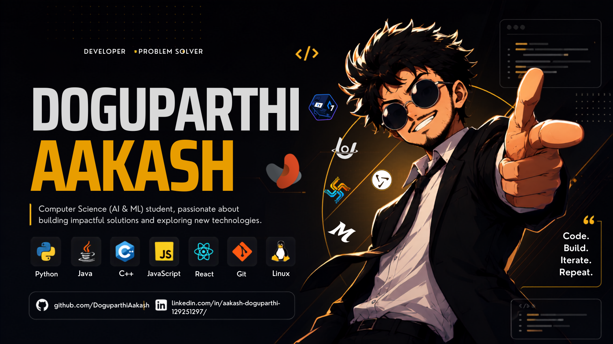
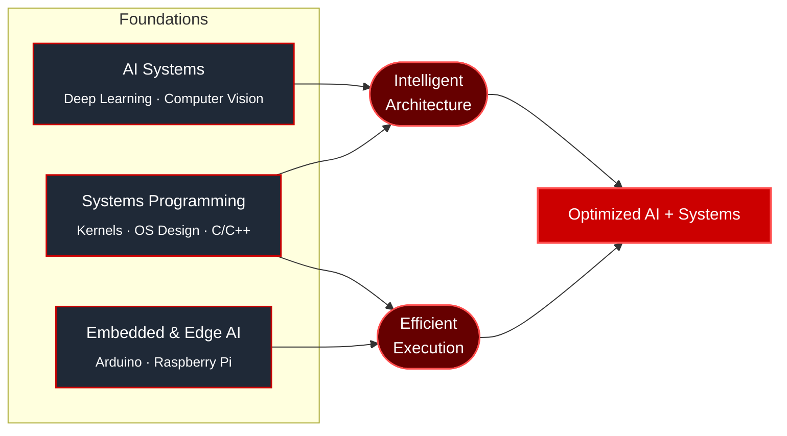
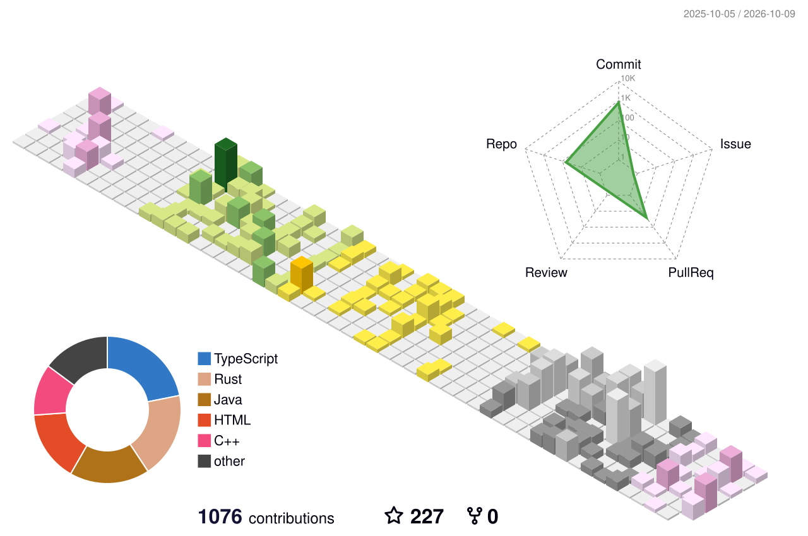

<div align="center">



# **Aakash Doguparthi**

## My main tech stack

<a href="https://skillicons.dev">
  
</a>

---

## Profile

**Engineering student in Artificial Intelligence & Machine Learning**

| Focus | Approach |
|---|---|
| Deep Learning & Computer Vision | Performance-oriented engineering |
| Edge AI & Embedded Systems | System-level thinking |
| Operating Systems & System Design | Practical implementation |

---

## Technical Domain


```mermaid
flowchart LR
    subgraph IN[" Foundations "]
        direction TB
        A["AI Systems<br/><sub>Deep Learning · Computer Vision</sub>"]
        B["Systems Programming<br/><sub>Kernels · OS Design · C/C++</sub>"]
        C["Embedded & Edge AI<br/><sub>Arduino · Raspberry Pi</sub>"]
    end

    IA(["Intelligent<br/>Architecture"])
    EE(["Efficient<br/>Execution"])

    A --> IA
    B --> IA
    B --> EE
    C --> EE
    IA --> OUT["Optimized AI + Systems"]
    EE --> OUT

    classDef src fill:#1f2937,stroke:#cc0000,color:#fff,stroke-width:1.5px;
    classDef mid fill:#660000,stroke:#ff4d4d,color:#fff,stroke-width:1.5px;
    classDef out fill:#cc0000,stroke:#ff4d4d,color:#fff,stroke-width:2px;
    class A,B,C src;
    class IA,EE mid;
    class OUT out;
```

---

## Technology Stack

<table>
  <tr>
    <td><b>AI / ML</b></td>
    <td>
      <br/>
      
      
      
      
      
      
      
      
    </td>
  </tr>
  <tr>
    <td><b>Systems</b></td>
    <td>
      <br/>
      
      
      
      
      
    </td>
  </tr>
  <tr>
    <td><b>Embedded</b></td>
    <td>
      
    </td>
  </tr>
  <tr>
    <td><b>Tools</b></td>
    <td>
      <br/>
      
    </td>
  </tr>
</table>

---

## GitHub Metrics

<div align="center">


<br/>


</div>

---

## GitHub Activity

<div align="center">

</div>
---

## Current Direction

* Deep learning and model optimization
* Operating system fundamentals and kernel design
* AI + systems integration
* Efficient and scalable architectures

---

## Contact

* GitHub: https://github.com/DoguparthiAakash
* Email: [doguparthiaakash@gmail.com](mailto:doguparthiaakash@gmail.com)
* LinkedIn: https://www.linkedin.com/in/aakash-doguparthi-129251297/

---

## Statement

```
Clarity in design.
Precision in execution.
Purpose in every system.
```

---

<div align="center">

</div>
